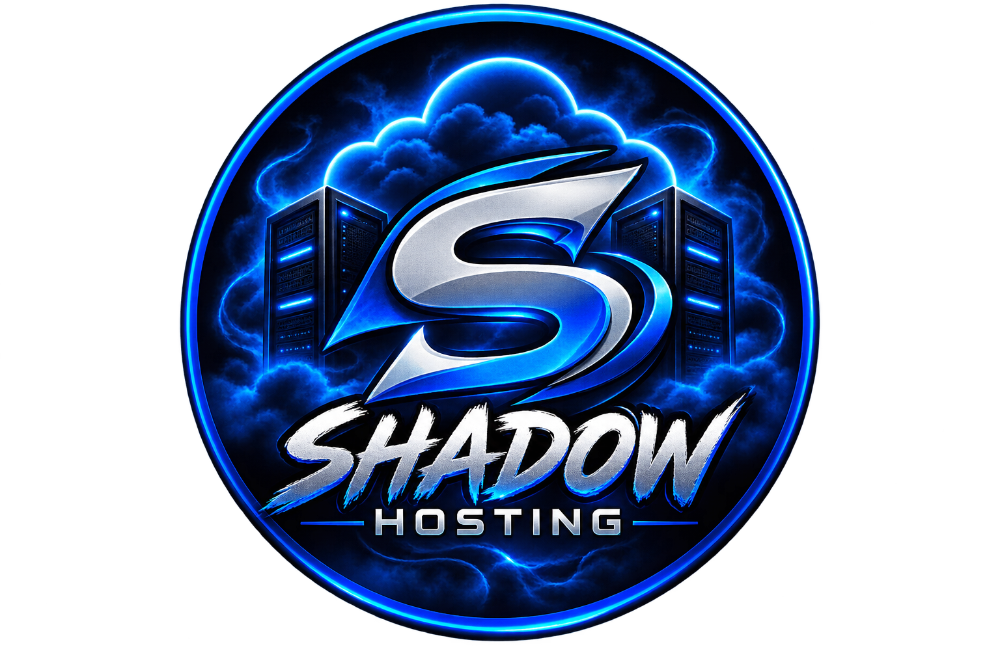

# 

# ShadowHosting

### Discord Bot & Telegram Hosting

Reliable, Easy-to-use Hosting for **Discord Bots** and **Telegram Bots** with Simple Deployment and 24/7 Online Hosting.

[🌐 Visit ShadowHosting](https://dash.shadowhostingx.dpdns.org/) • [🚀 Create an Account](https://dash.shadowhostingx.dpdns.org/register) • [🔐 Login](https://dash.shadowhostingx.dpdns.org/login)

---

## 🚀 About ShadowHosting

**ShadowHosting** Provides Hosting Designed for Discord and Telegram bot Projects | Python | NodeJs.

Whether you're Running a Small Personal Bot or a Larger Community Bot, ShadowHosting Gives You An Easy Way To Deploy and Manage Your Application.

### ✨ Features

* 🤖 Discord Bot Hosting
* 📱 Telegram Bot Hosting
* ⚡ Easy Deployment
* 🟢 24/7 Online Hosting
* 🖥️ Web-Based Panel Call Pterodactyl
* 📦 Simple Application Management
* 🚀 Fast Deployment
* 💻 Made by ShadowGamerzNET, Jasice_37, ManyXSPIDER

---

## 🌐 Get Started

### 1. Create your account

Create Your ShadowHosting Account:

**https://dash.shadowhostingx.dpdns.org/register**

### 2. Choose Your Hosting

Select the hosting Resources That fit Your Bot.

### 3. Deploy Your bot

Upload or Deploy Your Bot and Configure Your application.

### 4. 24/7 Unlimited

Start Your Bot and Manage it Through The ShadowHosting Panel.

---

## 📚 Useful Links

| Resource         | Link                                           |
| ---------------- | ---------------------------------------------- |
| 🌐 Website       | https://dash.shadowhostingx.dpdns.org/         |
| 🚀 Register      | https://dash.shadowhostingx.dpdns.org/register |
| 🔐 Login         | https://dash.shadowhostingx.dpdns.org/login    |
| 📖 Documentation | Coming soon                                    |
| 💬 Community     | Coming soon                                    |
| 🛠️ Support      | Coming soon                                    |

---

## 🤖 Discord Bot Hosting

Host Your Discord Bots With An Easy-To-Use Management Panel.

Supported Bot Environments Can Include Common Runtimes such as:

* Node.js
* Python
---

## 📱 Telegram Bot Hosting

Deploy and keep your Telegram bots online with ShadowHosting.

Build your bot, upload your project, configure the required environment, and start it from the panel.

Tip: Click on Startup Icon To Edit your app configure startup command & file name to start the app & Run a Bot from github repo & more

Open Source & Trust Website

---

## 🖥️ ShadowHosting Panel

Manage Your Applications from a Web-based Control Panel.

**Panel:**

https://dash.shadowhostingx.dpdns.org/

---

## 🔗 Official Website

### 🌐 https://dash.shadowhostingx.dpdns.org/

**ShadowHosting — Discord Bot & Telegram Hosting**

---

## 📢 About This Repository

This Repository Contains Information, Documentation, and Resources Related to ShadowHosting.

It Is **not** the Source code of the ShadowHosting Infrastructure.

---

**© ShadowHosting**

Made for Developers Building Discord and Telegram Bots

